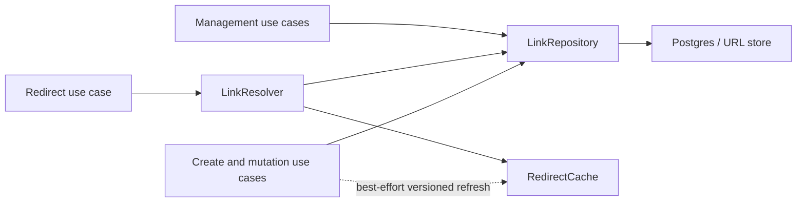
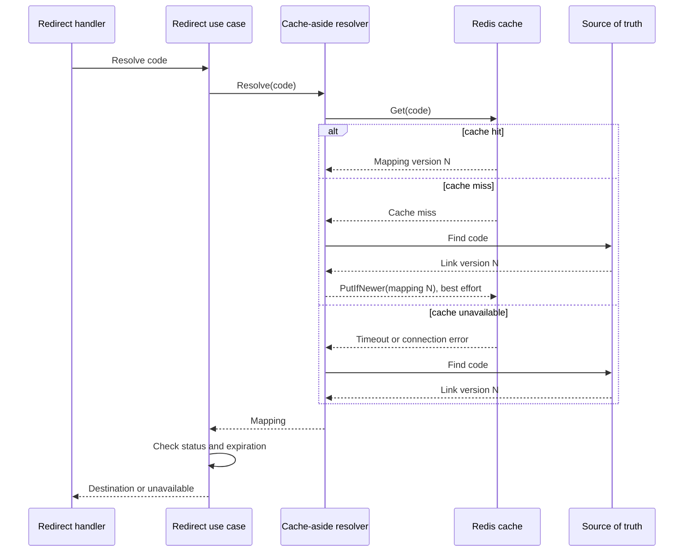
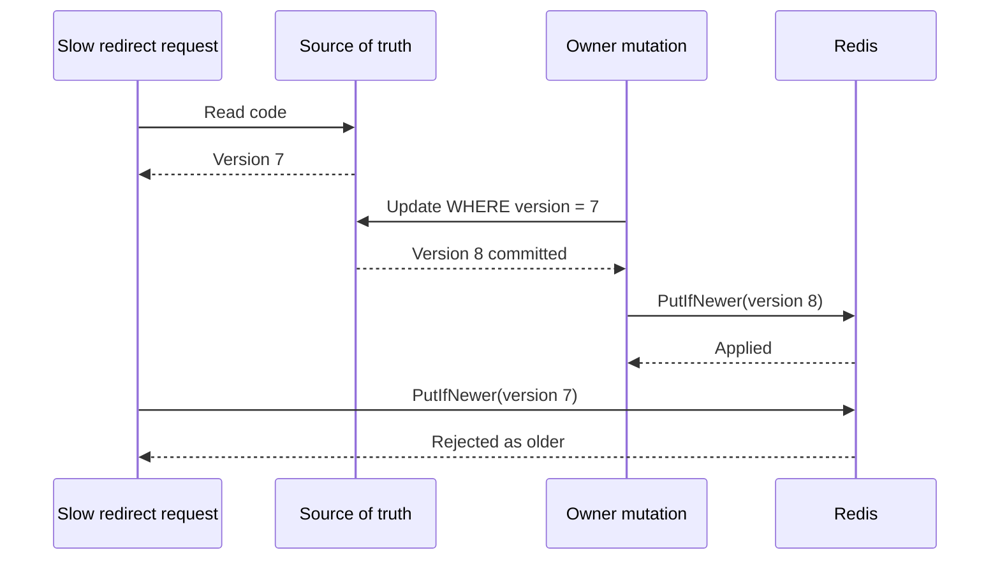
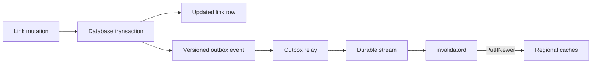

# Redirect Cache Design

## Document Status

- **Status:** proposed for the next implementation milestone
- **Scope:** regional Redis-compatible cache in front of the redirect source of truth
- **Related decision:** [ADR 0002](../adr/0002-versioned-cache-aside.md)

## Problem

Every redirect currently reads the link repository. That is correct but cannot
support a read-heavy URL shortener efficiently:

```text
visitor -> linkd -> Postgres
```

The cache must reduce source-of-truth traffic without allowing an older
destination, status, or expiration to overwrite a newer mutation.

## Goals

- Serve popular redirects without a database read.
- Fall back to the source of truth when Redis is unavailable.
- Keep cache failure out of service readiness.
- Validate status and expiration after every cache hit.
- Prevent late version `N` data from replacing version `N+1`.
- Exclude owner and management-only data from the redirect cache.
- Bound stale behavior with TTL before durable invalidation is implemented.

## Deferred Capabilities

- Negative caching for missing, expired, disabled, and deleted codes
- In-process L1 cache
- Per-code miss coalescing with `singleflight`
- Stale-while-revalidate during source-of-truth outages
- Transactional outbox and cross-process invalidation consumers
- CDN cache integration

These are useful, but adding them together would make correctness failures hard
to isolate.

## Architecture

Management reads must continue using the strongly consistent repository. Only
redirect resolution uses the cache-aside path.



This separation avoids a repository decorator that would accidentally serve
eventually consistent data to owner management reads.

## Redirect Read Model

The cache stores a redirect-specific projection rather than the complete link
aggregate:

```go
type RedirectMapping struct {
    Code        string
    Destination string
    Status      LinkStatus
    ExpiresAt   *time.Time
    Version     uint64
}
```

It intentionally excludes:

- owner ID
- creation and management timestamps
- idempotency data
- analytics data

The mapping still has enough information to decide whether redirecting is
allowed. It should expose behavior equivalent to:

```go
func (m RedirectMapping) CanRedirect(now time.Time) bool
```

## Proposed Ports

Names may be refined during implementation, but responsibilities must remain
separate:

```go
type LinkResolver interface {
    Resolve(ctx context.Context, code string) (domain.RedirectMapping, error)
}

type RedirectCache interface {
    Get(ctx context.Context, code string) (domain.RedirectMapping, error)
    PutIfNewer(
        ctx context.Context,
        mapping domain.RedirectMapping,
        ttl time.Duration,
    ) error
}
```

Expected errors:

```text
ErrRedirectCacheMiss -> normal miss; read source of truth
other cache error    -> dependency failure; record metric and read source of truth
ErrLinkNotFound      -> source of truth has no mapping
```

A cache miss is not an operational error and should not be logged at error
level.

## Cache-Aside Resolution



Algorithm:

```text
1. Attempt cache read with a short timeout.
2. On hit, return the mapping.
3. On miss or cache error, read the source of truth.
4. Project the link into a redirect mapping.
5. Fill the cache only when the mapping remains cacheable.
6. Return the mapping even if cache fill fails.
7. Validate status and expiration in the redirect use case.
```

The source of truth is authoritative. Redis never creates or mutates business
state.

## Versioned Write Rule

Every cache value includes the link version. Redis updates the value only when:

```text
incoming version >= stored version
```

Equal versions may refresh TTL. Lower versions are rejected.

The compare and write must be one atomic Redis operation. The implementation
may use a server-side script or transaction. If a script compares decimal
version strings, it must avoid floating-point conversion.

### Race Prevented By Versioning



Without the conditional write, the slow request could restore version `7`
after version `8` was already cached.

## Mutation Refresh

After a successful source-of-truth write, create and mutation use cases project
the updated link and attempt:

```text
PutIfNewer(updated mapping)
```

Status and expiration are cached as data, so disabled, deleted, or expired
mappings still produce an unavailable redirect when read.

Initial refresh behavior is best effort:

- The database write determines API success.
- Cache refresh failure is logged and metered.
- Existing cache TTL bounds stale behavior.

This is not the final cross-service guarantee. The durable design adds an
outbox row in the same transaction as the link mutation, then publishes a
versioned update consumed by `invalidatord`.



## Cache Key And Value

Proposed key:

```text
tinyurl:redirect:v1:{code}
```

Proposed logical payload:

```json
{
  "code": "aZ91KxP",
  "destination": "https://example.com/path",
  "status": "active",
  "expiresAt": "2026-07-01T12:00:00Z",
  "version": 8
}
```

The `v1` key namespace permits a future encoding migration without parsing
mixed formats. Values may use JSON initially for inspectability. A binary
encoding is justified only after profiling shows material network or CPU cost.

## TTL Policy

Initial defaults:

| Entry | TTL |
|---|---|
| Active mapping | 60 seconds |
| Disabled or deleted mapping | 30 seconds |
| Negative mapping | Deferred; proposed 15 seconds |

Rules:

- Clamp TTL so it never exceeds the remaining natural lifetime.
- Do not positively cache a mapping that is already expired.
- Add up to 10 percent jitter to avoid synchronized expiry.
- Make defaults configurable and tune them using hit-rate and staleness SLOs.
- Increase active TTL only after durable invalidation is operating reliably.

Short initial TTLs intentionally limit stale redirects while refresh is only
best effort.

## Timeouts And Resource Limits

Initial policy:

- Give cache operations a short independent context deadline.
- Start with a 25 ms regional cache timeout, then tune from observed latency.
- Bound Redis connection-pool size.
- Bound concurrent source-of-truth fallbacks so a Redis outage cannot create a
  database connection storm.
- Add per-code miss coalescing before large-scale load testing.

The request context remains the parent, so client cancellation also cancels
cache and database work.

## Failure Policy

| Condition | Redirect Behavior | Mutation Behavior |
|---|---|---|
| Cache miss | Read source of truth and fill cache | Not applicable |
| Cache timeout/error | Read source of truth | Commit source-of-truth write; refresh best effort |
| Cache contains expired mapping | Reject redirect; do not serve stale | Refresh with newer mutation when available |
| Cache contains disabled/deleted mapping | Reject redirect | Newer version may replace it |
| Source of truth unavailable, cache hit | Serve only active, unexpired mapping | Mutation fails |
| Source of truth unavailable, cache miss | Return service error | Mutation fails |
| Older fill arrives after mutation | `PutIfNewer` rejects it | No effect |
| Redis unavailable during readiness probe | Service remains ready if source of truth is ready | Not applicable |

Redis improves latency and absorbs load. It is not a correctness authority and
must not become a mandatory dependency for basic availability.

## Negative Caching

Negative caching is intentionally deferred because it introduces an additional
creation race:

```text
request caches "not found"
owner creates that code
negative value remains
```

The eventual implementation must carry a version or creation-safe invalidation
strategy, use a short TTL, and refresh on successful creation.

## Request Coalescing

Without coalescing, a popular key expiring can cause many simultaneous source
reads:

```text
10,000 cache misses -> 10,000 database reads
```

The later L1 or resolver layer should use per-code `singleflight` behavior:

```text
10,000 cache misses -> one database read -> shared result
```

Coalescing must respect request cancellation and avoid retaining unbounded keys.

## Operational Configuration

Proposed environment variables:

| Variable | Default | Purpose |
|---|---|---|
| `TINYURL_CACHE` | `none` | `none` or `redis` |
| `TINYURL_REDIS_ADDR` | none | Redis address, required for Redis cache |
| `TINYURL_CACHE_TTL` | `60s` | Active mapping TTL |
| `TINYURL_CACHE_TIMEOUT` | `25ms` | Per-operation timeout |
| `TINYURL_CACHE_JITTER` | `0.10` | Maximum fractional TTL jitter |

Local Compose should expose Redis on host port `6380` to avoid assuming the
default host port is free.

Redis is omitted from readiness. Its health is observed through cache metrics
and alerts.

## Observability

Metrics:

- `redirect_cache_get_total{result=hit|miss|error}`
- `redirect_cache_put_total{result=applied|older|error}`
- `redirect_cache_operation_duration_seconds{operation=get|put}`
- `redirect_source_lookup_total{reason=miss|cache_error}`
- `redirect_mapping_age_seconds`
- `redirect_cache_version_rejection_total`

Logs:

- Cache connection-state transitions
- Serialization or schema-version errors
- Best-effort mutation refresh failures

Do not log one line per cache miss and do not use short code as a metric label.

## Test Matrix

### Unit

- Hit bypasses repository.
- Miss reads repository and fills cache.
- Cache error falls back to repository.
- Older versions cannot replace newer versions.
- Equal versions may refresh TTL.
- TTL is clamped to expiration.
- Expired, disabled, and deleted mappings do not redirect.

### Integration

- Redis payload round trip
- Atomic version comparison under concurrent writes
- Redis restart and reconnect
- Mutation refresh changes subsequent redirects
- Cache outage does not change readiness

### Load And Failure

- Hot-key hit rate
- Cache-expiry stampede
- Redis latency and outage
- Database fallback concurrency limit
- Invalidation lag after outbox implementation

## Rollout

1. Add redirect projection and cache/resolver ports.
2. Implement no-cache resolver to preserve existing behavior.
3. Add Redis to local Compose and implement the adapter.
4. Enable Redis behind `TINYURL_CACHE=redis`.
5. Add synchronous versioned refresh after writes.
6. Observe hit rate, fallback load, and stale windows.
7. Add negative caching and `singleflight`.
8. Add transactional outbox and invalidation consumers.
9. Add an in-process L1 cache only if profiling justifies it.
