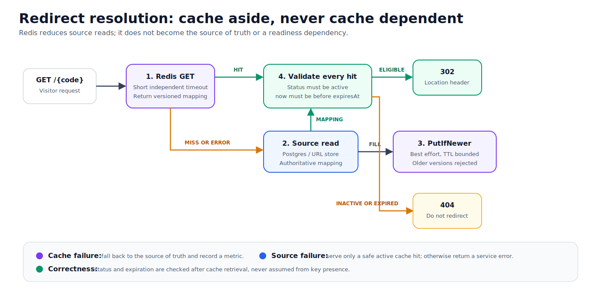
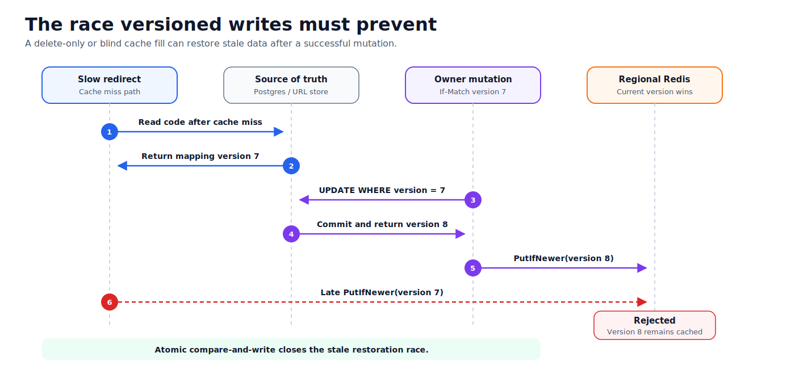

# Redirect Cache Design

## Decision

Add a Redis-compatible regional cache only to the redirect read path.
Management reads continue using the source of truth.



## Why A Separate Resolver?

Management reads need the latest version for `If-Match`. Redirect reads favor
latency and can tolerate bounded staleness.

```text
Management -> LinkRepository -> source of truth
Redirect   -> LinkResolver   -> Redis -> source of truth fallback
```

Putting caching inside `LinkRepository` would apply eventual consistency to
both paths.

## Cache Entry

Store only data needed for redirect correctness:

```go
type RedirectMapping struct {
    Code        string
    Destination string
    Status      LinkStatus
    ExpiresAt   *time.Time
    Version     uint64
}
```

Do not cache owner ID, idempotency data, or management timestamps.

Proposed key:

```text
tinyurl:redirect:v1:{code}
```

## Ports

```go
type LinkResolver interface {
    Resolve(ctx context.Context, code string) (domain.RedirectMapping, error)
}

type RedirectCache interface {
    Get(ctx context.Context, code string) (domain.RedirectMapping, error)
    PutIfNewer(
        ctx context.Context,
        mapping domain.RedirectMapping,
        ttl time.Duration,
    ) error
}
```

`ErrRedirectCacheMiss` is a normal control-flow result. Other cache errors are
dependency failures and trigger source fallback.

## Resolution Algorithm

```text
1. Read Redis with a short timeout.
2. On hit, return the mapping.
3. On miss or Redis error, read the source of truth.
4. Convert the link to RedirectMapping.
5. Fill Redis with PutIfNewer, best effort.
6. Validate status and expiration.
7. Return 302 or unavailable.
```

Redis is an optimization, never the authority.

## Version Rule

Redis applies a mapping only when:

```text
incoming version >= stored version
```

The compare and write must be atomic. Equal versions may refresh TTL. Older
versions are rejected.



This closes the race where:

```text
slow redirect reads version 7
owner commits and caches version 8
slow redirect attempts to cache version 7
```

A blind write or delete-only invalidation would allow version `7` to return.

## Mutation Refresh

After a successful create or mutation:

```text
database commit
-> project updated mapping
-> PutIfNewer(updated version), best effort
```

The database result determines API success. Cache refresh failure is metered but
does not roll back a committed mutation.

This initial approach has a bounded stale window. The durable design later adds:

```text
database transaction
-> link update + outbox event
-> event stream
-> invalidatord
-> PutIfNewer in every region
```

## TTL

Initial values:

| Entry | TTL |
|---|---|
| Active mapping | 60 seconds |
| Disabled or deleted mapping | 30 seconds |
| Negative mapping | Deferred; proposed 15 seconds |

Rules:

- Clamp TTL to remaining natural lifetime.
- Do not positively cache an already expired mapping.
- Add up to 10 percent jitter.
- Keep TTL short until durable invalidation exists.

## Failure Policy

| Condition | Behavior |
|---|---|
| Cache hit | Validate mapping and respond |
| Cache miss | Read source and fill cache |
| Cache timeout/error | Read source and record metric |
| Source unavailable, safe cache hit | Serve active, unexpired mapping |
| Source unavailable, miss | Return service error |
| Expired/disabled/deleted mapping | Never redirect |
| Older cache fill | Reject by version |
| Mutation refresh failure | Keep committed write; TTL bounds staleness |

Redis is not checked by `/readyz`. The source of truth remains the required
dependency.

When Redis is configured, `/internal/diagnostics` still pings Redis and reports
latency. That endpoint is protected and informational; Redis failure should be
visible to operators without becoming a routing decision.

## Operational Defaults

| Variable | Default |
|---|---|
| `TINYURL_CACHE` | `none` |
| `TINYURL_REDIS_ADDR` | required for Redis |
| `TINYURL_CACHE_TTL` | `60s` |
| `TINYURL_CACHE_TIMEOUT` | `25ms` |
| `TINYURL_CACHE_JITTER` | `0.10` |

Local Redis uses host port `6380`.

## Required Metrics

```text
cache get: hit | miss | error
cache put: applied | older | error
cache operation duration
source fallback: miss | cache_error
version rejection count
mapping age
```

Never use short code as a metric label.

## Deferred Work

### Negative Caching

Useful for invalid-code traffic, but creation must invalidate a cached
not-found result. Add it only after positive cache correctness is proven.

### Request Coalescing

When a hot key expires:

```text
without coalescing: 10,000 misses -> 10,000 source reads
with singleflight:  10,000 misses -> 1 source read
```

Add bounded per-code coalescing before load testing.

### L1 Cache

Add an in-process cache only after profiling. Redis is the first shared regional
layer so replicas do not warm independently.

## Verification

- Hit bypasses source.
- Miss reads source and fills Redis.
- Redis outage falls back and does not change readiness.
- Older version cannot replace newer version.
- Mutation changes the next redirect.
- TTL never exceeds expiration.
- Expired, disabled, and deleted mappings never redirect.
- Concurrent hot-key misses remain bounded after coalescing is added.

## Rollout

1. Add `RedirectMapping`, resolver, and cache ports.
2. Add a no-cache resolver preserving current behavior.
3. Add Redis adapter and local Compose service.
4. Enable with `TINYURL_CACHE=redis`.
5. Refresh cache after writes.
6. Measure hit rate, fallback load, and stale windows.
7. Add negative caching, coalescing, and durable invalidation.

See [ADR 0002](../adr/0002-versioned-cache-aside.md) for alternatives and
consequences.
