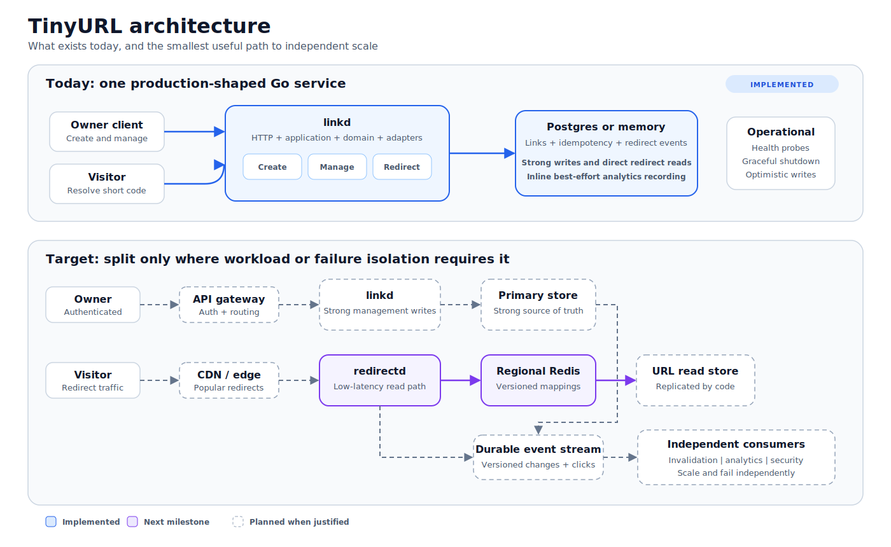

# TinyURL System Architecture

## Purpose

This is the implementation-facing system design. It separates:

- **Implemented:** behavior available in the repository now
- **Next:** regional redirect caching
- **Planned:** service splits and infrastructure justified by scale



## Design In One Sentence

Keep owner writes strongly consistent and make the much larger redirect workload
a cache-friendly, independently scalable read path.

## Requirements

### Functional

- Create short links safely under retries.
- Redirect only active, unexpired links.
- Read and mutate owner links using resource versions.
- Update status, destination, and expiration.
- Record lightweight click analytics.
- Later support custom aliases and urgent security takedowns.

### Quality

- Redirect traffic scales independently from management writes.
- Cache and analytics failures do not block valid redirects.
- Concurrent writes cannot silently overwrite one another.
- Deleted, disabled, and expired links do not redirect once the latest version
  is observed.
- Domain and application code do not import infrastructure SDKs.

## Current State

One `linkd` process hosts creation, management, redirects, and analytics
recording.

| Capability | Status |
|---|---|
| Generated-code creation and idempotency | Implemented |
| Redirect validation | Implemented |
| Versioned management reads and writes | Implemented |
| Memory and Postgres adapters | Implemented |
| Liveness, readiness, graceful shutdown | Implemented |
| Redirect event recording | Implemented inline |
| Versioned Redis redirect cache | Implemented; optional per deployment |
| Azure Container Apps deployment | Implemented; scale-to-zero demo topology |
| Durable invalidation and asynchronous analytics | Planned |
| Verified authentication | Planned; `X-Owner-ID` is temporary |

## Target Boundaries

| Workload | Owns | Why It May Split |
|---|---|---|
| `linkd` | Create and owner mutations | Strong consistency and moderate write load |
| `redirectd` | Code resolution and click publication | Very high read load and low latency |
| `invalidatord` | Versioned cache refresh | Independent event processing |
| `analyticsd` | Click aggregation | Batch and append-heavy workload |
| `securityd` | Scanning and emergency blocks | Separate trust and urgency requirements |

Splitting is driven by scaling or failure isolation. Until then, one binary can
host multiple capabilities.

## Code Boundaries

```text
cmd/linkd
  -> wires configuration, lifecycle, and adapters

HTTP adapters
  -> translate requests and responses

Application
  -> coordinates use cases and ports

Domain
  -> owns link invariants and transitions

Infrastructure adapters
  -> Postgres, memory, Redis, and event systems
```

Dependency direction:

```text
cmd -> adapters -> application -> ports/domain
```

Domain and application packages never depend on HTTP, Postgres, Redis, Kafka,
or deployment frameworks.

## Source Of Truth

The link aggregate contains:

```text
code
destination
owner ID
status: active | disabled | deleted
createdAt / updatedAt
optional expiresAt
monotonic version
```

Rules:

- New links start at version `1`.
- Every successful mutation increments version.
- `now >= expiresAt` means expired.
- Disabled links may be reactivated.
- Deleted links are terminal.
- Destinations allow only HTTP and HTTPS.

## Core Flows

### Create

```text
HTTP request
-> check owner/idempotency key
-> validate destination
-> generate code
-> insert link
-> save idempotency result
-> return 201
```

### Redirect

```text
GET /{code}
-> resolve mapping
-> verify active and unexpired
-> record click best effort
-> return 302
```

The next milestone inserts Redis-backed cache-aside resolution before the
source-of-truth read.

### Mutation

```text
PATCH + If-Match
-> read current link
-> verify owner and version
-> apply domain mutation
-> UPDATE WHERE version = expected
-> return new ETag
```

The database comparison closes the race between read and write. A stale client
receives `412 Precondition Failed`.

## Consistency

| Operation | Model |
|---|---|
| Code creation | Strong uniqueness |
| Idempotent creation | Strong per owner/key |
| Owner mutation | Optimistic strong write |
| Owner management read | Source-of-truth read |
| Redirect cache read | Bounded eventual consistency |
| Analytics | Eventual |
| Emergency block | Separate urgent consistency path |

## Failure Policy

| Failure | Behavior |
|---|---|
| Redis unavailable | Fall back to source of truth; remain ready |
| Source unavailable, cache hit | Serve only active and unexpired cached data |
| Source unavailable, cache miss | Return service error |
| Analytics unavailable | Redirect continues |
| Concurrent mutation | One succeeds; stale request gets `412` |
| Graceful termination | Stop new traffic, drain, close resources |
| Abrupt process loss | Database transactions and constraints preserve state |

## Security

- Production identity comes from verified authentication or a trusted gateway.
- Management responses are private and non-cacheable.
- Owner mismatch returns `404` to reduce existence disclosure.
- Cache values exclude owner and management-only data.
- Emergency blocks do not wait for ordinary cache invalidation.

## Required Signals

- Redirect rate, latency, and errors
- Cache hit, miss, error, and version rejection
- Source lookup latency and fallback load
- Mutation conflicts and idempotency outcomes
- Invalidation and analytics lag
- Readiness and shutdown duration

Do not use code, owner ID, or destination URL as metric labels.

## Delivery Order

1. **Complete:** durable single-region create, redirect, management, health, and
   analytics recording.
2. **Complete:** Redis cache-aside resolver with versioned writes.
3. **Next:** verified authentication, rate limiting, and production
   observability.
4. Negative caching and per-code miss coalescing.
5. Transactional outbox and durable invalidation.
6. Asynchronous analytics pipeline.
7. Independent `redirectd`, CDN, multi-region reads, and emergency denylist.

Code creation currently uses cryptographically random eight-character Base62
codes. Postgres enforces uniqueness, and creation retries a collision at most
five times. This works across process restarts and replicas without a shared
counter. At much larger scale, measure collision retries and capacity before
choosing a longer code, range allocator, or Snowflake-style ID encoded as
Base62.

## References

- [Redirect Cache Design](redirect-cache.md)
- [ADR 0001: Postgres Persistence](../adr/0001-postgres-persistence.md)
- [ADR 0002: Versioned Cache-Aside](../adr/0002-versioned-cache-aside.md)
- [Postgres Schema](../schema/postgres.md)
