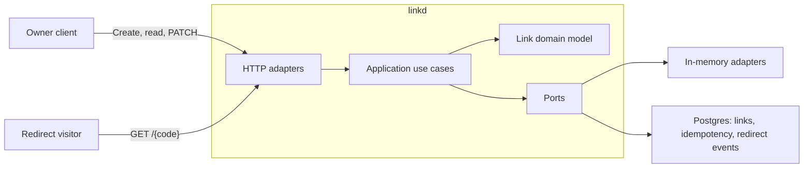
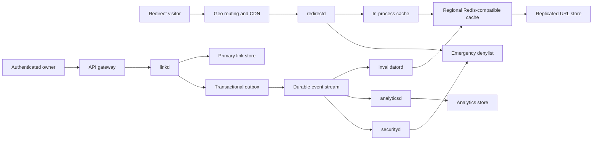
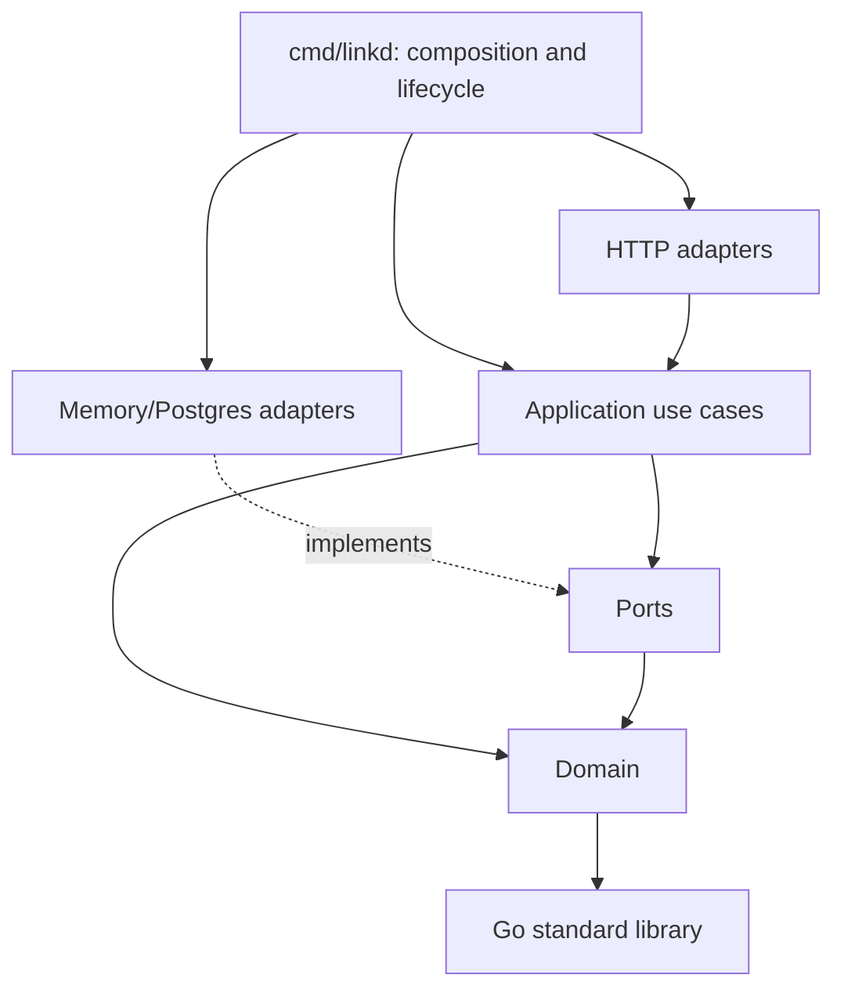
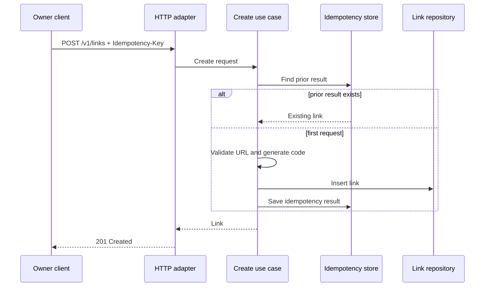
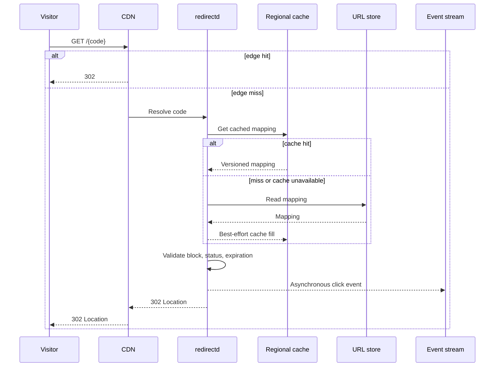
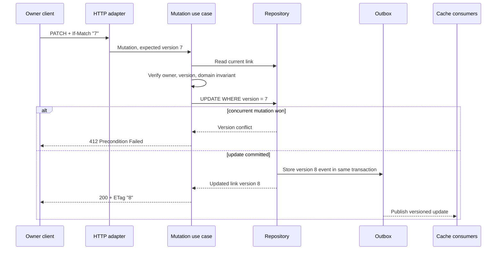

# TinyURL System Architecture

## Document Status

- **Purpose:** authoritative architecture overview for implementation and review
- **Current implementation:** single-region `linkd` process with memory or Postgres storage
- **Target architecture:** independently scalable management, redirect, invalidation, security, and analytics workloads

This document distinguishes implemented behavior from planned architecture.
Detailed cache correctness lives in [Redirect Cache Design](redirect-cache.md).
Postgres details live in [Postgres Schema](../schema/postgres.md).

## Goals

### Functional

- Create short links safely under client retries.
- Redirect active, unexpired links with low latency.
- Read and mutate owner-managed links with optimistic concurrency.
- Support destination, status, and expiration updates.
- Record lightweight redirect analytics without requiring heavy dashboards.
- Eventually support custom aliases, abuse scanning, and emergency takedowns.

### Quality Attributes

- Redirect traffic scales independently from management traffic.
- Link creation and mutation remain strongly consistent.
- Cached redirect reads may be eventually consistent within an explicit bound.
- Analytics and cache failures do not prevent otherwise valid redirects.
- Deleted, disabled, and expired links never redirect once their latest version
  is observed.
- Infrastructure choices stay behind application ports.

### Non-Goals For The Current Stage

- Global multi-region deployment
- CDN configuration
- Heavy analytics dashboards
- Billing and account management
- Full authentication implementation
- Exactly-once event processing

## Workload Shape

Let:

- `R` be redirect requests per second.
- `W` be create and mutation requests per second.
- `H` be the combined cache hit ratio.

The central workload assumption is:

```text
R >> W
```

Approximate source-of-truth read load after caching is:

```text
origin reads per second = R * (1 - H)
```

The design therefore optimizes redirect reads for latency and horizontal scale,
while preserving stronger consistency for the much smaller write workload.

## Current Runtime

The implemented system is one Go process. It is production-shaped, but not yet
split into independently deployable services.



### Implemented Capabilities

| Capability | Current State |
|---|---|
| Generated short-code creation | Implemented |
| Idempotent create requests | Implemented |
| Redirect with status and expiration checks | Implemented |
| Owner management read with `ETag` | Implemented |
| Versioned status, destination, and expiration mutation | Implemented |
| Memory and Postgres persistence | Implemented |
| Best-effort redirect event recording | Implemented inline |
| Liveness, readiness, graceful shutdown | Implemented |
| Regional Redis cache | Planned |
| Durable invalidation stream and outbox | Planned |
| Service split and CDN | Planned |
| Verified authentication | Planned; `X-Owner-ID` is temporary |

## Target System Context



The current Postgres database fills the primary-store and lightweight analytics
roles. Those roles can separate when traffic or operational ownership requires
it.

## Service Ownership

| Workload | Responsibility | Scaling Characteristic | Current Deployment |
|---|---|---|---|
| `linkd` | Create, owner reads, lifecycle mutations | Consistency and moderate write load | Implemented |
| `redirectd` | Resolve codes and emit click events | Very high read load and low latency | Inside `linkd` |
| `invalidatord` | Apply versioned cache updates | Event throughput and convergence | Planned |
| `analyticsd` | Aggregate lightweight click data | Append and batch processing | Inline recorder today |
| `securityd` | Scan destinations and distribute blocks | Asynchronous scanning plus urgent updates | Planned |

The split is driven by workload and failure isolation, not by a desire to create
many services. Until independent scaling is needed, one binary may host several
application capabilities.

## Code Architecture



Rules:

- Domain packages contain entities, value objects, invariants, and domain
  errors.
- Application packages coordinate use cases and depend on ports.
- Ports describe required capabilities without naming vendors.
- Adapters translate HTTP, Postgres, Redis, and event protocols.
- `cmd` owns configuration, dependency wiring, startup, and shutdown.
- Domain and application code do not import infrastructure SDKs.

## Core Data

The link aggregate is the source of redirect correctness:

```text
Link
|- code
|- destination
|- owner ID
|- status: active | disabled | deleted
|- created and updated timestamps
|- optional expiration
`- monotonically increasing version
```

Key invariants:

- Creation starts at version `1`.
- Every successful mutation increments version.
- Expiration is exclusive: `now >= expiresAt` is expired.
- Disabled links may be reactivated.
- Deleted links are terminal.
- Destination URLs use only HTTP or HTTPS.

## Core Flows

### Create Link



At target scale, link insertion and idempotency ownership must be atomic or
reconciled so a timeout cannot create multiple links for one key.

### Redirect



The current implementation performs the repository lookup directly and records
analytics inline. Redis and asynchronous event publication are planned.

### Versioned Mutation



The repository version check is implemented. Transactional outbox publication
is planned.

### Redirect Analytics

```text
Current:
redirect handler -> recorder -> Postgres -> 302

Target:
redirect handler -> bounded asynchronous publish -> 302
event stream -> analyticsd -> aggregation store
```

The target removes analytics latency and availability from the redirect
critical path. Event loss policy, buffering, and sampling must be explicit.

## Consistency Model

| Operation | Required Consistency | Reason |
|---|---|---|
| Code creation | Strong uniqueness | Two links cannot claim one code |
| Idempotent creation | Strong per owner/key | Retries must return one result |
| Owner mutation | Optimistic strong write | Prevent lost updates |
| Owner management read | Source-of-truth read | Client needs current version |
| Redirect cache read | Bounded eventual | Latency and availability dominate |
| Security block check | Stronger urgent path | Stale malicious redirects are unsafe |
| Analytics | Eventual | Does not affect redirect correctness |

## Failure Behavior

| Failure | Expected Behavior |
|---|---|
| Redis unavailable | Fall back to the URL store; do not fail readiness |
| URL store unavailable | Serve only policy-approved stale cache entries |
| Analytics unavailable | Redirect continues; buffer, sample, or drop by policy |
| Mutation cache refresh fails | Database commit remains authoritative; TTL bounds staleness until durable invalidation exists |
| Concurrent mutation | One write succeeds; stale writer receives `412` |
| Process receives termination signal | Stop new traffic, drain requests, close resources |
| Process is killed abruptly | Database constraints and transactions preserve durable correctness |

## Security Boundaries

- External identity must come from verified authentication.
- A trusted gateway must remove client-supplied internal identity headers before
  injecting its own principal data.
- Owner mismatches return `404` to reduce resource-existence disclosure.
- Redirect destinations accept only HTTP and HTTPS.
- Management responses are private and non-cacheable.
- Emergency security blocks use a separate fast denylist instead of waiting for
  ordinary cache invalidation.

## Observability

Minimum signals:

- Redirect request rate, latency, and status
- Cache hit, miss, stale, error, and version-rejection counts
- URL-store latency and errors
- Create and mutation success, conflict, and idempotency rates
- Invalidation publication and consumer lag
- Analytics publication failures and queue lag
- Readiness state and graceful-shutdown duration

Use bounded-cardinality labels. Never label metrics with raw short codes, owner
IDs, or destination URLs.

## Evolution Plan

1. **Complete:** durable single-region create, redirect, management, analytics,
   health, and graceful shutdown.
2. **Next:** regional Redis cache with cache-aside reads and versioned refresh.
3. Add negative caching and per-code request coalescing.
4. Add transactional outbox and durable invalidation consumers.
5. Move redirect analytics to a bounded asynchronous event pipeline.
6. Split `redirectd` from `linkd` when independent scaling is justified.
7. Add CDN, multi-region reads, emergency denylist, and automated failover.

## Related Documents

- [Redirect Cache Design](redirect-cache.md)
- [ADR 0001: Postgres Persistence](../adr/0001-postgres-persistence.md)
- [ADR 0002: Versioned Cache-Aside Redirect Resolution](../adr/0002-versioned-cache-aside.md)
- [Postgres Schema](../schema/postgres.md)
- [Local Postgres Development](../development/postgres.md)
