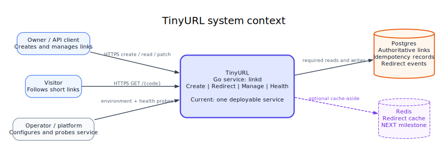
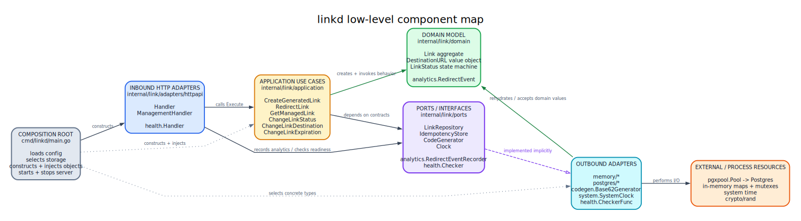
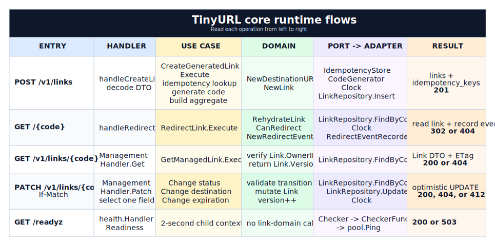
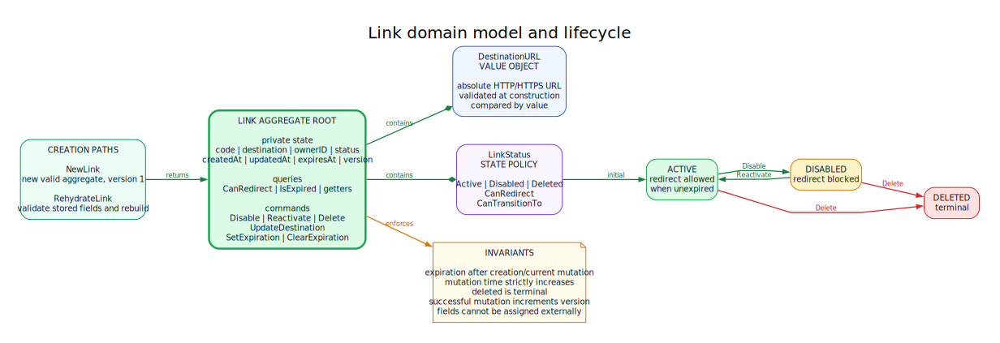
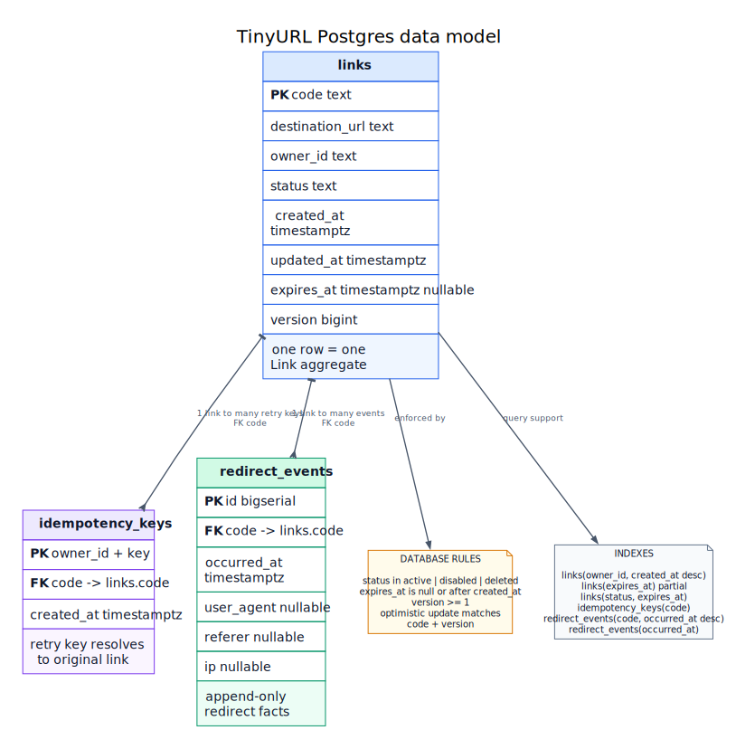

# TinyURL Visual Architecture

This is the visual entry point to the system. Read top to bottom for progressively
deeper views; each diagram answers a different question without repeating the
entire design.

## 1. System Context

Who uses TinyURL, what runs today, and which external systems it depends on.
Dashed elements are planned rather than currently active.

## 2. Production Architecture

How the current service grows into the target production topology. The redirect
path stays latency-sensitive while management, security, invalidation, and
analytics can evolve independently.

## 3. Service LLD

How Go code is composed inside the current service: HTTP adapters call
application use cases, use cases own domain orchestration, ports express needed
capabilities, and concrete adapters reach infrastructure.

Solid arrows are runtime calls, dashed arrows mean interface satisfaction, and
dotted arrows show construction or dependency injection.

## 4. Runtime Flows

How the major requests cross the layers. Read each row from left to right to see
the handler, use case, domain behavior, adapter call, and HTTP result.

## 5. Domain Model

The `Link` aggregate protects lifecycle, destination, expiration, and version
invariants. `DestinationURL` validates URL meaning, while `LinkStatus` constrains
legal state transitions.

## 6. Data Model

How aggregates, idempotency records, redirect facts, constraints, and indexes
are represented in Postgres.

## Focused Views

- [Project Visual Map](project_mindmap.md) explains the Go and design patterns
  used by the current code.
- [Redirect Cache Design](redirect-cache.md) covers cache-aside reads,
  invalidation, races, and the planned Redis adapter.
- [System Architecture](system-overview.md) records current-versus-target
  boundaries and production design decisions.

The editable Graphviz `.dot` source for each generated diagram lives beside its
`.svg` file under `docs/architecture/diagrams/`.
