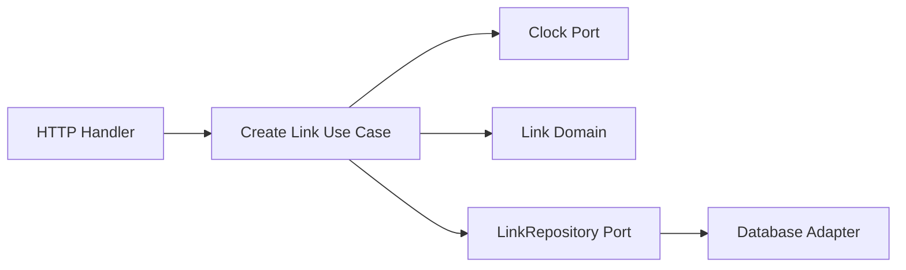

# TinyURL Architecture Context

## Why the Repository Is Layered

The project separates business behavior from external technology:

```text
HTTP / gRPC adapters
        |
Application use cases
        |
Domain model and ports
        |
Database / cache / event adapters
```

The direction of source-code dependencies matters:

```text
adapters -> ports/application/domain
application -> ports/domain
ports -> domain
domain -> standard library only
```

The domain must not import databases, HTTP routers, Redis, or Kafka.

## Domain

Location:

```text
internal/link/domain/
```

Responsibilities:

- Represent valid values.
- Enforce lifecycle rules.
- Prevent invalid state transitions.
- Protect internal state.
- Answer business questions such as whether a link can redirect.

Examples:

- `LinkStatus`
- `DestinationURL`
- `Link`

Why structs and private fields?

```go
type Link struct {
	status LinkStatus
}
```

External packages cannot directly assign `link.status`. They must call behavior such as `Disable`, which preserves invariants.

## Ports

Location:

```text
internal/link/ports/
```

Ports describe capabilities that application code needs from the outside world:

```go
type Clock interface {
	Now() time.Time
}

type LinkRepository interface {
	Insert(ctx context.Context, link domain.Link) error
	FindByCode(ctx context.Context, code string) (domain.Link, error)
	Update(ctx context.Context, link domain.Link, expectedVersion uint64) error
}
```

Ports contain contracts, not database logic.

Why define interfaces here?

The application knows what behavior it needs. A PostgreSQL adapter should conform to the application's needs rather than forcing the application to conform to PostgreSQL details.

## Adapters

Location:

```text
internal/link/adapters/
```

Adapters will implement ports:

```text
PostgreSQL repository -> LinkRepository
System clock          -> Clock
HTTP handler          -> calls application use cases
Kafka publisher       -> event-publishing port
```

A test fake is also an adapter, just one designed for tests.

## Application

Location:

```text
internal/link/application/
```

Application use cases coordinate domain objects and ports.

Conceptual create-link flow:

```text
receive command
-> ask Clock for current time
-> create DestinationURL
-> create Link
-> ask LinkRepository to insert
-> return result
```

Application code does not know whether the repository uses PostgreSQL, memory, or a remote service.

## Why `context.Context` Appears in Ports

Repository operations may involve slow external work. Context lets the caller propagate:

- Cancellation.
- Deadlines.
- Request-scoped metadata.

```go
FindByCode(ctx context.Context, code string)
```

Rules:

- Context is the first parameter.
- Name it `ctx`.
- Pass it downward.
- Do not store it in a struct.
- Do not use it for ordinary business parameters.

### Context Scopes in TinyURL

Each request begins with a request context. Individual external calls may derive shorter-lived children:

```text
HTTP request context
├── URL-store lookup context with timeout
├── cache lookup context with timeout
└── event-publication context with timeout
```

These contexts differ because each operation has a different lifetime and cancellation policy.

If the client disconnects, cancellation of the request context propagates to every child operation. If only event publication times out, that child is cancelled without cancelling the whole request.

## Why Versioned Updates Exist

Two callers may read version `3` simultaneously:

```text
Caller A reads version 3
Caller B reads version 3
Caller A updates and stores version 4
Caller B attempts update based on stale version 3
```

The repository method:

```go
Update(ctx, changedLink, expectedVersion)
```

allows storage to reject Caller B with `ErrVersionConflict`.

This is optimistic concurrency control.

## How a Request Will Eventually Flow



The interfaces make the use case testable:

```text
production: real clock + database repository
test:       fake clock + in-memory/fake repository
```

## Decision Guide

Ask these questions when deciding where code belongs:

| Question                                        | Likely location |
| ----------------------------------------------- | --------------- |
| Is this a business invariant?                   | Domain          |
| Is this coordination of several operations?     | Application     |
| Is this a required external capability?         | Port            |
| Is this PostgreSQL, HTTP, Redis, or Kafka code? | Adapter         |
| Is this process startup and wiring?             | `cmd/`          |
